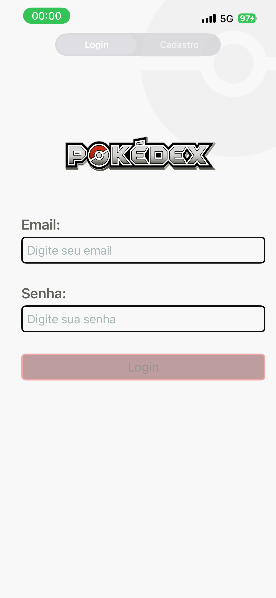
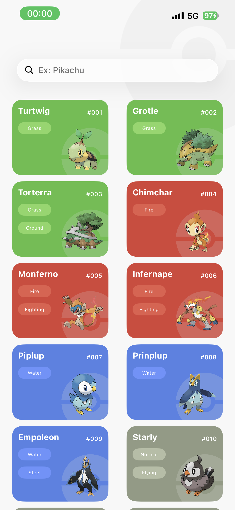
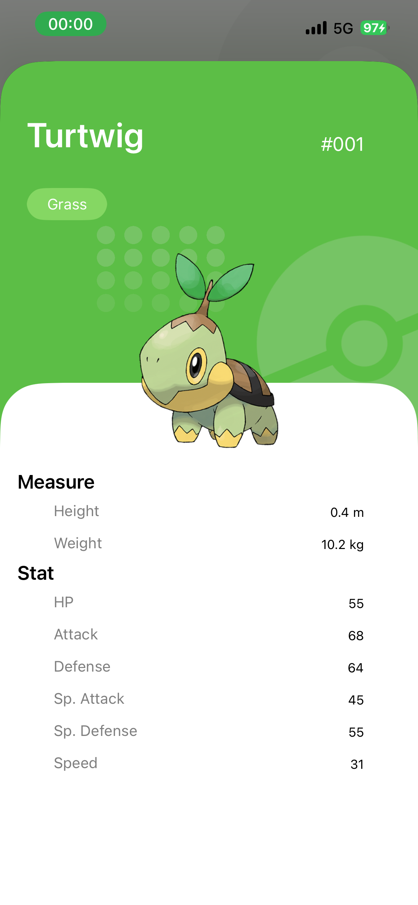

# Gen4Dex 📱

> Pokédex da 4ª geração desenvolvida em Swift com UIKit, ViewCode e arquitetura MVVM.

<br>

https://github.com/BRyuTakahashi/Gen4Dex/raw/main/screenshots/record.gif

<br>

## 📸 Telas

| Login | Pokédex | Detalhe |
|-------|---------|---------|
|  |  |  |

<br>

## 🛠 Tecnologias

- **Swift** — linguagem principal
- **UIKit** — construção de interfaces via ViewCode (sem Storyboard)
- **MVVM** — arquitetura de apresentação com separação de responsabilidades
- **URLSession + DispatchGroup** — requisições paralelas à PokeAPI
- **Codable** — decodificação seletiva de JSON
- **SDWebImage** — carregamento e cache de imagens
- **Firebase Auth** — autenticação de usuários (login e cadastro)

<br>

## 📐 Arquitetura

O projeto segue o padrão **MVVM** organizado por features:

```
PokedexProject/
├── Feature/
│   ├── Login/
│   │   ├── View/
│   │   └── LoginViewController
│   ├── Home/
│   │   ├── View/
│   │   ├── ViewModel/
│   │   ├── Service/
│   │   └── HomeViewController
│   └── PokemonDetail/
│       ├── View/
│       └── PokemonDetailViewController
├── Model/
├── Service/
└── Utils/
```

A comunicação entre ViewModel e ViewController é feita via **protocolo delegate**, mantendo as camadas desacopladas.

<br>

## 🔌 API

O app consome a [PokéAPI](https://pokeapi.co/) em duas etapas:

1. Busca a lista dos 107 Pokémons da 4ª geração (`offset=386&limit=107`)
2. Para cada URL retornada, dispara requisições paralelas com `DispatchGroup` para buscar nome, tipos, sprites e stats

<br>

## 🚀 Como rodar

**Pré-requisitos:** Xcode 15+, CocoaPods

```bash
git clone https://github.com/BRyuTakahashi/Gen4Dex.git
cd Gen4Dex
pod install
open PokedexProject.xcworkspace
```

> ⚠️ É necessário adicionar o arquivo `GoogleService-Info.plist` do Firebase para que a autenticação funcione.

<br>

## 👨‍💻 Autor

**Bruno Takahashi**

[](https://www.linkedin.com/in/bruno-takahashi-97b0b01b8)
[](https://github.com/BRyuTakahashi)
